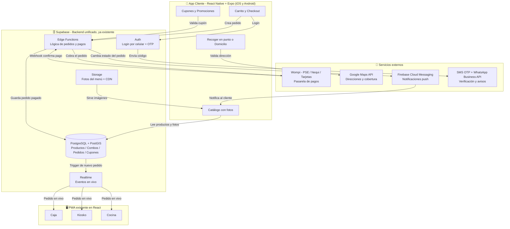

# Stack Tecnológico — App de Pedidos (estilo Frisby)

Documento de referencia técnica para la construcción de la app móvil de pedidos, integrada con la PWA existente de Caja / Kiosko / Cocina (React + Supabase Edge Functions).

---

## 1. Frontend móvil: React Native + Expo

**Decisión:** React Native con el framework Expo, para publicar en App Store y Google Play desde una sola base de código.

**Justificación:**
- Reutiliza el conocimiento de React/JSX/hooks que ya usa el equipo en la PWA — no se requiere aprender Swift ni Kotlin desde cero.
- Un solo código fuente para iOS y Android, reduciendo tiempo y costo de mantenimiento frente a desarrollo nativo puro.
- Para una app de catálogo + carrito + checkout, el rendimiento de React Native es más que suficiente. La app no requiere gráficos 3D ni procesamiento nativo intensivo.
- Expo incluye **EAS Build**, que compila y sube directamente a App Store y Google Play sin necesitar una Mac física, además de **actualizaciones OTA** (over-the-air) para corregir bugs de JavaScript sin pasar de nuevo por revisión de las tiendas.

**Alternativa descartada:** Flutter (Dart). Técnicamente válido, pero rompería la sinergia con la PWA en React, obligando al equipo a manejar dos lenguajes distintos (Dart + JS/TS) en vez de uno solo.

---

## 2. Backend: extender el Supabase existente (no crear uno nuevo)

**Decisión:** No se construye un backend adicional (Node/Django/Laravel). La app móvil se conecta al **mismo proyecto de Supabase** que ya usa la PWA de caja/kiosko/cocina.

**Justificación:**
- Fuente única de verdad: catálogo, combos, promociones y pedidos son los mismos que consume la cocina — cero duplicación ni desincronización de datos.
- Las **Edge Functions** (Deno/TypeScript) manejan la lógica sensible: creación del pedido, validación de cupones, comunicación con la pasarela de pagos y confirmación vía webhook. La app móvil nunca debe hablar directo con la pasarela de pagos.
- Escalabilidad administrada: Supabase corre sobre Postgres gestionado con autoescalado, sin necesidad de administrar servidores propios.

---

## 3. Base de datos: PostgreSQL (vía Supabase) + extensión PostGIS

**Justificación:**
- Los datos son altamente relacionales: productos ↔ combos ↔ promociones ↔ cupones ↔ pedidos ↔ clientes ↔ direcciones. Postgres garantiza integridad referencial.
- Soporte de **JSONB** para campos flexibles (ej. personalización de un combo) sin perder robustez relacional en lo transaccional (inventario, precios, pagos).
- **PostGIS**: cálculo de zonas de cobertura, distancia real y validación de si una dirección cae dentro del radio de entrega de un punto de venta.
- Transacciones ACID: crítico para evitar cobros duplicados o aplicación repetida de un cupón.

---

## 4. Almacenamiento de fotos del menú: Supabase Storage

**Justificación:**
- Integrado en el mismo proyecto, sin necesidad de contratar un servicio aparte.
- Compatible con S3, con CDN incluido para carga rápida de imágenes.
- URLs firmadas para control de acceso cuando se requiera.

**Recomendación opcional:** pasar las imágenes por **Cloudinary** o el transformador de imágenes de Supabase para generar automáticamente versiones en WebP y distintos tamaños (thumbnail, detalle, banner), impactando directamente en velocidad de carga y conversión.

---

## 5. Pasarela de pagos (Colombia): Wompi (principal) + PayU / ePayco (alternativas)

**Justificación de Wompi:**
- Soporte nativo para los métodos más usados en Colombia: **PSE** (débito a cualquier banco), **Nequi**, **Bancolombia a un clic**, tarjetas de crédito/débito y **Efecty** (pago en efectivo en puntos físicos).
- Comisiones competitivas y API/webhooks bien documentados.

**Flujo correcto de integración:**
1. La Edge Function crea la transacción/payment link en Wompi.
2. El cliente paga desde la app.
3. Wompi envía un webhook a la Edge Function confirmando el pago.
4. Solo entonces se marca el pedido como pagado y se envía a cocina.

Esto evita exponer llaves secretas dentro de la app móvil.

**Alternativas:** PayU (mejor si se expande a otros países de LATAM) o ePayco (buena opción local adicional, útil como respaldo/redundancia).

---

## 6. Mensajería: tres capas distintas

| Tipo | Uso | Tecnología sugerida |
|---|---|---|
| Notificaciones push | "Tu pedido está listo", "va en camino", promociones semanales | Firebase Cloud Messaging (gratis) |
| SMS / OTP | Verificación de celular al registrarse (previene fraude y abuso de cupones) | Twilio, Infobip o Labsmobile |
| WhatsApp Business API | Confirmación de pedido y factura por el canal más revisado en Colombia | Twilio WhatsApp API o Meta Cloud API |

**Capa adicional — mensajería interna del sistema:** Supabase Realtime conecta el pedido nuevo del cliente con la PWA de cocina/caja/kiosko en tiempo real. Al confirmarse el pago, Postgres dispara un evento y la pantalla de cocina lo recibe al instante, sin necesidad de refrescar.

---

## 7. Mapas y geolocalización: Google Maps SDK para React Native

Uso: capturar la dirección de entrega, validar cobertura (con PostGIS), calcular tiempo/costo estimado de domicilio, y habilitar rastreo del repartidor en tiempo real a futuro.

---

## 8. Piezas complementarias

- **Autenticación:** Supabase Auth (login por celular + OTP).
- **Manejo de estado/datos en la app:** TanStack Query (React Query) para fetching y caché de datos de Supabase, más Zustand para estado local del carrito.
- **Monitoreo de errores:** Sentry.
- **Analítica de producto:** Firebase Analytics o PostHog.

---

## 9. Resumen del stack

| Componente | Tecnología | Justificación breve |
|---|---|---|
| App móvil | React Native + Expo | Reutiliza React, un solo código para iOS/Android, publicación simplificada |
| Backend | Supabase (existente) | Evita duplicar infraestructura, todo sincronizado con la PWA |
| Lógica de servidor | Edge Functions (Deno/TS) | Manejo seguro de pagos y cupones |
| Base de datos | PostgreSQL + PostGIS | Integridad relacional + cálculo geográfico para domicilios |
| Fotos del menú | Supabase Storage (+ Cloudinary opcional) | CDN incluido, integrado al mismo proyecto |
| Pagos Colombia | Wompi (PSE, Nequi, tarjetas, Bancolombia, Efecty) | Cobertura completa de métodos de pago locales |
| Notificaciones | Firebase Cloud Messaging | Push gratuito para estado de pedidos |
| Verificación | SMS/OTP + WhatsApp Business API | Antifraude en registro + confirmaciones por canal preferido |
| Sincronía en tiempo real | Supabase Realtime | Conecta pedidos nuevos con la PWA sin recargar pantalla |
| Mapas | Google Maps SDK | Direcciones, cobertura y cálculo de distancia |

---

## 10. Flujo del pedido, de punta a punta

---

## Próximo paso sugerido

Diseñar el modelo de base de datos (tablas: productos, combos, promociones, cupones, pedidos, direcciones, pagos) para comenzar a construir directamente sobre Supabase.
